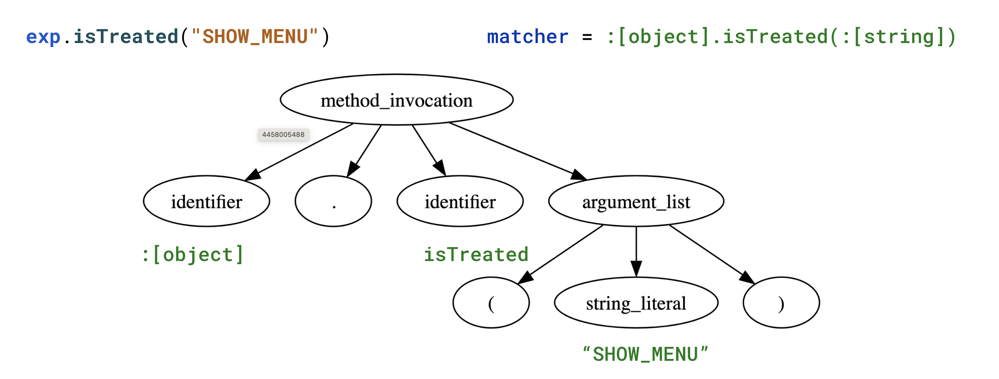

Piranha offers support for three distinct rule languages for matching and replacement of code.

# Tree-sitter Queries

The Tree-sitter queries language is one of the rule languages that Piranha supports. For a detailed understanding of the syntax, refer to the [Tree-sitter Syntax Reference](https://tree-sitter.github.io/tree-sitter/syntax-highlighting#queries).

# Regular Expressions (Regex)

Regex forms another rule language supported by Piranha. To create a rule in regex, prepend your query with `rgx `. For instance: `rgx <your regex query>`. Piranha supports the regex syntax derived from the [regex](https://docs.rs/regex/) crate.

# Concrete Syntax

Piranha's Concrete Syntax is a custom rule language designed for matching and replacing code. Concrete Syntax operates at the parse tree level, similar to [comby](https://comby.dev/), yet with a distinct difference: it will only match a node if it is possible to traverse the corresponding its parse tree from start to finish using the concrete syntax template.

Template variables `:[x], :[y], ...` are used as placeholders to match arbitrary nodes (i.e., syntactically meaningful constructs).

Consider the following code snippet:
```java
exp.isTreated("SHOW_MENU")
```
To match this code snippet, we can use the concrete syntax (cs) template:
```java
cs :[object].isTreated(:[string])
```

which matches the method invocation nodes as follows: 


